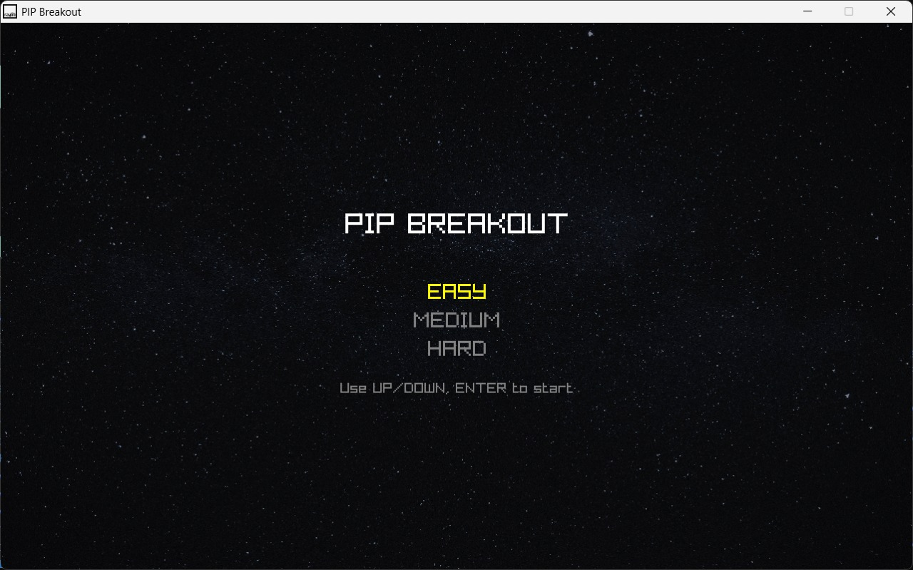
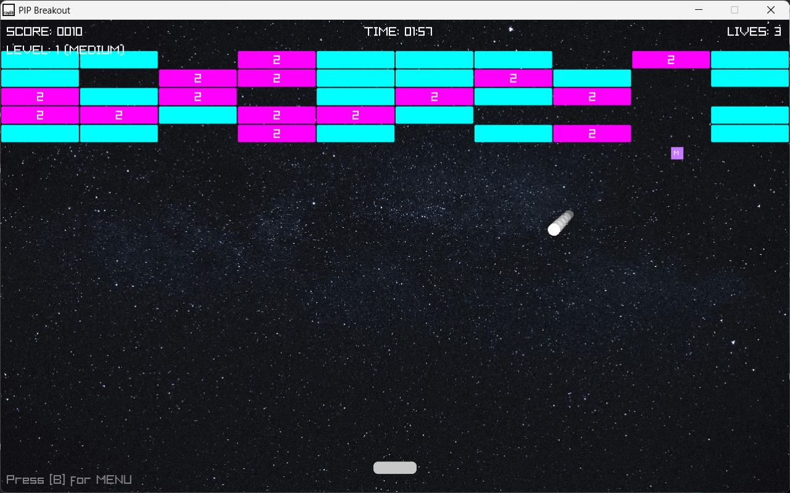

# PIP Breakout

A modern implementation of the classic PIP Breakout game using C++ and the Raylib library. This version includes multiple difficulty levels, power-ups, moving bricks, and a timer-based challenge.

## Features

- **Three Difficulty Levels**:

  - **Easy**: Larger paddle, fewer bricks, 1.5-minute timer.
  - **Medium**: Smaller paddle, more bricks with 1-2 hits required, 2-minute timer.
  - **Hard**: Smallest paddle, most bricks with 1-3 hits required, some bricks move, 2.5-minute timer.

- **Power-Ups**:

  - **Paddle Size Up**: Increases paddle width.
  - **Ball Speed Up**: Increases ball speed.
  - **Extra Life**: Grants an additional life.
  - **Multi-Ball**: Spawns two additional balls.

- **Game Mechanics**:

  - Score tracking and lives system.
  - Countdown timer that reduces lives when it runs out.
  - Moving bricks in Hard mode for added challenge.
  - Paddle-ball collision with dynamic ball direction based on hit position.

- **Visuals and Controls**:

  - Matte black background for a sleek look.
  - Color-coded bricks and power-ups.
  - Controls: Arrow keys (Left/Right) for paddle movement, \[P\] to pause, \[B\] to return to menu, \[Enter\] for menu navigation.

## Prerequisites

- **C++ Compiler**: A C++17 compatible compiler (e.g., GCC, Clang, MSVC).
- **Raylib**: The Raylib library must be installed. Follow the Raylib installation guide for your platform.
- **CMake** (optional): For easier build configuration.

## Installation

1. **Clone the Repository**:

   ```bash
   git clone https://github.com/yourusername/PIP-breakout.git
   cd PIP-breakout
   ```

2. **Install Raylib**:

   - Follow the instructions on the Raylib website or use a package manager:

     - **Ubuntu**:

       ```bash
       sudo apt-get install libraylib-dev
       ```

     - **macOS** (Homebrew):

       ```bash
       brew install raylib
       ```

     - **Windows**: Download prebuilt binaries or build from source.

3. **Build the Game**:

   - **Using a Compiler Directly**:

     ```bash
     g++ main.cpp -o breakout -lraylib -lGL -lm -lpthread -ldl -lrt -lX11
     ```

     Adjust flags based on your platform (e.g., remove `-lX11` on Windows/macOS).

   - **Using CMake** (if a `CMakeLists.txt` is provided):

     ```bash
     mkdir build && cd build
     cmake ..
     make
     ```

4. **Run the Game**:

   ```bash
   ./breakout
   ```

## How to Play

- **Menu**:

  - Use **Up/Down Arrow Keys** to select difficulty (Easy, Medium, Hard).
  - Press **Enter** to start the game.

- **Gameplay**:

  - Move the paddle with **Left/Right Arrow Keys** to bounce the ball.
  - Break all bricks to win the level.
  - Catch power-ups for bonuses.
  - Watch the timer—running out costs a life.
  - Press **P** to pause/unpause, **B** to return to the menu.

- **Objective**:

  - Clear all bricks before losing all lives or running out of time.
  - Progress through levels (Easy to Hard) with increasing difficulty.

## Screenshots



## Acknowledgments

- Built with Raylib, a simple and easy-to-use library for game development.
- Inspired by the classic PIP Breakout game.

---

*Have fun breaking bricks!*